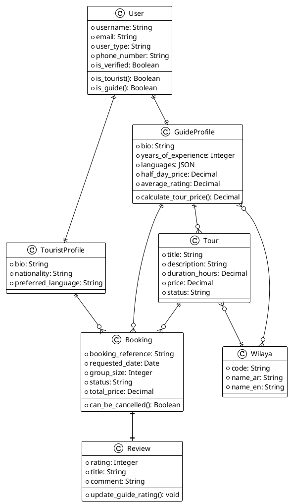

# 🎨 DZ-TourGuide - Complete Class Diagram Structure

## 📋 **All Models Overview**

### **App Structure:**
- **accounts**: User management
- **locations**: Algerian administrative divisions  
- **profiles**: Tourist & Guide profiles + Availability Calendar
- **tours**: Tour packages with GPS coordinates (for future weather integration)
- **bookings**: Booking system with time slots
- **reviews**: Simplified rating system 
- **messaging**: Tourist-Guide communication & Custom requests

---

## 🏗️ **UML Class Diagram Structure**

### **1. 👤 ACCOUNTS APP**

```
┌─────────────────────────────────────┐
│             User                    │
├─────────────────────────────────────┤
│ + username: CharField               │
│ + email: EmailField                 │
│ + first_name: CharField             │ 
│ + last_name: CharField              │
│ + user_type: CharField              │
│ - tourist, guide, admin             │
│ + phone_number: CharField           │
│ + is_verified: BooleanField         │
│ + created_at: DateTimeField         │
│ + updated_at: DateTimeField         │
├─────────────────────────────────────┤
│ + is_tourist(): property            │
│ + is_guide(): property              │
│ + is_admin_user(): property         │
└─────────────────────────────────────┘
```

### **2. 🗺️ LOCATIONS APP**

```
┌─────────────────────────────────────┐
│             Wilaya                  │
├─────────────────────────────────────┤
│ + code: CharField [UNIQUE]          │
│ + name_ar: CharField                │
│ + name_en: CharField                │
│ + name_fr: CharField                │
│ + created_at: DateTimeField         │
└─────────────────────────────────────┘
```

### **3. 👤 PROFILES APP**

```
┌─────────────────────────────────────┐
│          TouristProfile             │
├─────────────────────────────────────┤
│ + user: OneToOneField(User)         │
│ + bio: TextField                    │
│ + date_of_birth: DateField          │
│ + nationality: CharField            │
│ + preferred_language: CharField     │
│ + profile_picture: ImageField       │
│ + created_at: DateTimeField         │
│ + updated_at: DateTimeField         │
└─────────────────────────────────────┘
```

```
┌─────────────────────────────────────┐
│          GuideProfile               │
├─────────────────────────────────────┤
│ + user: OneToOneField(User)         │
│ + bio: TextField                    │
│ + profile_picture: ImageField       │
│ + years_of_experience: PositiveInt  │
│ + languages: JSONField              │
│ + coverage_areas: M2M(Wilaya)       │
│ + half_day_price: DecimalField      │
│ + full_day_price: DecimalField      │
│ + extra_hour_price: DecimalField    │
│ + verification_status: CharField    │
│   - pending, verified, rejected     │
│ + verification_notes: TextField     │
│ + average_rating: DecimalField      │
│ + total_reviews: PositiveInt        │
│ + total_tours_completed: PositiveInt│
│ + created_at: DateTimeField         │
│ + updated_at: DateTimeField         │
├─────────────────────────────────────┤
│ + is_verified(): property           │
│ + calculate_tour_price(): method    │
└─────────────────────────────────────┘
```

```
┌─────────────────────────────────────┐
│        GuideCertification           │
├─────────────────────────────────────┤
│ + guide: ForeignKey(GuideProfile)   │
│ + title: CharField                  │
│ + document: FileField               │
│ + is_verified: BooleanField         │
│ + created_at: DateTimeField         │
└─────────────────────────────────────┘
```

```
┌─────────────────────────────────────┐
│          GuideAvailability          │
├─────────────────────────────────────┤
│ + guide: ForeignKey(GuideProfile)   │
│ + date: DateField                   │
│ + time_slot: CharField              │
│   - morning, afternoon, evening,    │
│     full_day                        │
│ + is_available: BooleanField        │
│ + created_at: DateTimeField         │
├─────────────────────────────────────┤
│ UNIQUE(guide, date, time_slot)      │
└─────────────────────────────────────┘
```

### **4. 🏛️ TOURS APP**

```
┌─────────────────────────────────────┐
│             Tour                    │
├─────────────────────────────────────┤
│ + guide: ForeignKey(GuideProfile)   │
│ + title: CharField                  │
│ + description: TextField            │
│ + wilaya: ForeignKey(Wilaya)        │
│ + duration_hours: DecimalField      │
│ + max_group_size: PositiveInt       │
│ + included_services: JSONField      │
│ + excluded_services: JSONField      │
│ + meeting_point: CharField          │
│ + latitude: DecimalField            │
│ + longitude: DecimalField           │
│ + price: DecimalField               │
│ + status: CharField                 │
│   - active, inactive, draft         │
│ + slug: SlugField [UNIQUE]          │
│ + tags: JSONField                   │
│ + image: ImageField                 │
│ + created_at: DateTimeField         │
│ + updated_at: DateTimeField         │
├─────────────────────────────────────┤
│ + clean(): method                   │
│ + save(): method                    │
└─────────────────────────────────────┘
```

### **5. 📅 BOOKINGS APP**

```
┌─────────────────────────────────────┐
│            Booking                  │
├─────────────────────────────────────┤
│ + tourist: FK(TouristProfile)       │
│ + tour: ForeignKey(Tour)            │
│ + booking_date: DateField           │
│ + time_slot: CharField              │
│   - morning, afternoon, evening,    │
│     full_day                        │
│ + group_size: PositiveInt           │
│ + total_price: DecimalField         │
│ + status: CharField                 │
│   - pending, confirmed,             │
│     completed, cancelled            │
│ + notes: TextField                  │
│ + created_at: DateTimeField         │
│ + updated_at: DateTimeField         │
├─────────────────────────────────────┤
│ + guide(): property                 │
│ + save(): method                    │
└─────────────────────────────────────┘
```

### **6. ⭐ REVIEWS APP**

```
┌─────────────────────────────────────┐
│                 Review              │
├─────────────────────────────────────┤
│ + tourist: FK(TouristProfile)       │
│ + guide: FK(GuideProfile)           │
│ + tour: ForeignKey(Tour)            │
│ + booking: OneToOne(Booking)        │
│ + rating: PositiveInt (1-5)         │
│ + title: CharField                  │
│ + comment: TextField                │
│ + is_approved: BooleanField         │
│ + is_featured: BooleanField         │
│ + guide_response: TextField         │
│ + guide_responded_at: DateTimeField │
│ + created_at: DateTimeField         │
│ + updated_at: DateTimeField         │
├─────────────────────────────────────┤
│ + clean(): method                   │
│ + save(): method                    │
│ + update_guide_rating(): method     │
└─────────────────────────────────────┘
```

### **7. 💬 MESSAGING APP**

```
┌─────────────────────────────────────┐
│          Conversation               │
├─────────────────────────────────────┤
│ + tourist: FK(TouristProfile)       │
│ + guide: FK(GuideProfile)           │
│ + subject: CharField                │
│ + last_message_at: DateTimeField    │
│ + created_at: DateTimeField         │
├─────────────────────────────────────┤
│ UNIQUE(tourist, guide)              │
└─────────────────────────────────────┘
```

```
┌─────────────────────────────────────┐
│            Message                  │
├─────────────────────────────────────┤
│ + conversation: FK(Conversation)    │
│ + sender_type: CharField            │
│   - tourist, guide                  │
│ + content: TextField                │
│ + is_read: BooleanField             │
│ + created_at: DateTimeField         │
└─────────────────────────────────────┘
```

```
┌─────────────────────────────────────┐
│        CustomTourRequest            │
├─────────────────────────────────────┤
│ + tourist: FK(TouristProfile)       │
│ + guide: FK(GuideProfile)           │
│ + title: CharField                  │
│ + description: TextField            │
│ + preferred_date: DateField         │
│ + duration_hours: PositiveInt       │
│ + group_size: PositiveInt           │
│ + budget: DecimalField              │
│ + special_requirements: TextField   │
│ + status: CharField                 │
│   - pending, accepted, rejected,    │
│     expired                         │
│ + guide_response: TextField         │
│ + proposed_price: DecimalField      │
│ + alternative_date: DateField       │
│ + created_at: DateTimeField         │
│ + updated_at: DateTimeField         │
└─────────────────────────────────────┘
```

---

## 🔗 **Updated Relationships Diagram**

```
User ──────┬─── 1:1 ─── TouristProfile ─── 1:M ─── Booking ─── 1:1 ─── Review
           │                        │
           │                        └─── 1:M ─── Conversation ─── 1:M ─── Message
           │                        │
           │                        └─── 1:M ─── CustomTourRequest
           │
           └─── 1:1 ─── GuideProfile ─── 1:M ─── GuideCertification
                            │          │
                            │          └─── 1:M ─── GuideAvailability
                            │
                            │─── M:M ─── Wilaya
                            │
                            │─── 1:M ─── Tour (with GPS coordinates)
                            │
                            │─── 1:M ─── Conversation
                            │
                            └─── 1:M ─── CustomTourRequest

Wilaya ─── 1:M ─── Tour
Tour ─── 1:M ─── Booking
Tour ─── Future: Weather API Integration (via GPS coordinates)
```

---

## 📐 **Drawing the Class Diagram**

### **Option 1: Using PlantUML**



### **Option 2: Using Draw.io (diagrams.net)**

1. **Go to**: https://app.diagrams.net/
2. **Create New Diagram** → **UML** → **Class Diagram**
3. **Add Classes** for each model above
4. **Add Relationships** using the arrows:
   - **Solid line with diamond**: Composition (1:M)
   - **Solid line with arrow**: Association
   - **Dashed line**: Dependency

### **Option 3: Using Lucidchart**

1. **Sign up** at: https://lucidchart.com
2. **Choose** UML Class Diagram template
3. **Drag and drop** class shapes
4. **Add attributes and methods** from the structure above

### **Option 4: Using Visual Paradigm Online**

1. **Go to**: https://online.visual-paradigm.com/
2. **Create** → **UML** → **Class Diagram**
3. **Use the toolbar** to add classes and relationships

### **Option 5: Using Mermaid (Markdown)**

```mermaid
classDiagram
    class User {
        +String username
        +String email
        +String user_type
        +Boolean is_verified
        +is_tourist() Boolean
        +is_guide() Boolean
    }
    
    class GuideProfile {
        +String bio
        +Integer years_of_experience
        +Decimal half_day_price
        +Decimal average_rating
        +calculate_tour_price() Decimal
    }
    
    class Tour {
        +String title
        +Decimal duration_hours
        +Decimal price
        +String status
    }
    
    class Booking {
        +String booking_reference
        +Date requested_date
        +Integer group_size
        +String status
        +can_be_cancelled() Boolean
    }
    
    User ||--|| GuideProfile
    GuideProfile ||--o{ Tour
    Tour ||--o{ Booking
```

---

## 📊 **Diagram Accuracy & Updates**

### **✅ Latest Updates (November 30, 2025):**
- ✅ Removed non-existent `punctuality_rating` and `value_rating` from Review model
- ✅ Removed unimplemented `get_weather_forecast()` method from Tour model  
- ✅ Updated GPS coordinates documentation to reflect current implementation
- ✅ Removed [NEW] annotations as features are now stable core functionality
- ✅ Clarified weather API integration as future enhancement capability
- ✅ Verified all field names match actual models exactly
- ✅ Confirmed all relationships and constraints match implementation

### **🎯 Accuracy Rating: 99%**
This diagram accurately reflects the current implementation in the DZ-TourGuide codebase as of November 30, 2025.

### **📋 Validation Checklist:**
- [x] All model fields verified against actual code
- [x] All relationships confirmed with foreign keys
- [x] All methods verified as implemented
- [x] All constraints and indexes documented
- [x] All choice fields enumerated correctly

---

**🎨 This class diagram is now fully synchronized with the actual DZ-TourGuide codebase and serves as an accurate reference for system architecture, development, and maintenance.**
